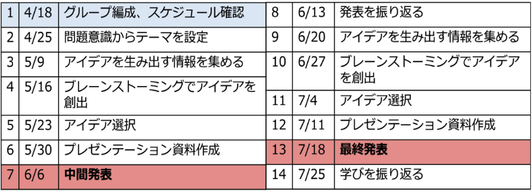
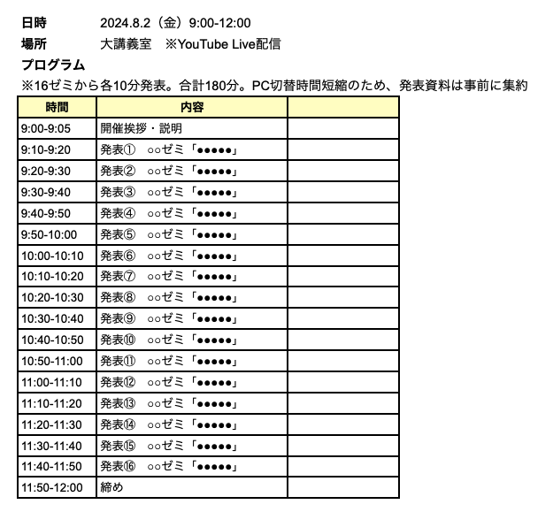

## Week 1 

<xl>
Welcome to Yoh Zemi! 
</xl>

Call me "Yoh"

In this class, we will call each other by first name 😙

## First, let's get Slacked

## Find your Latitude/Longitude coordinates

1. go to https://maps.google.com
1. zoom to your hometown (生まれた場所)
1. right click!
1. copy the coordinates
1. enter it in the class roster [google sheet](https://docs.google.com/spreadsheets/d/1va1fv9ZPp1DxxBTajYe_NKH7_JNh-6_u/edit#gid=1328967021)

## Use kepler to map all your classmates

1. download the class [google sheet](https://docs.google.com/spreadsheets/d/1va1fv9ZPp1DxxBTajYe_NKH7_JNh-6_u/edit#gid=1328967021) as a csv file
1. go to http://kepler.gl
1. map your classmates!

 
あえてやり方を教えません 
隣の人と相談しながらカッコイイ地図を作ってね！

## Introduce yourself

- your <plum>first</plum> name 
- about your <plum>hometown</plum>
- your <plum>passion</plum>
- what <plum>topics</plum> are you interested in for this zemi?

## Quick check!

1. How are classes?
1. Any computer problems? 
1. Anybody switch from PC→Mac?
1. Office365 install?

## Boring stuff...

1. [大学に問い合わせるには？](1_麗澤大学2024-春セメ_「大学に問い合わせるには？」.pdf)
1. [麗澤ポータルとは？](2_麗澤大学2024-春セメ_「麗澤ポータルとは？」.pdf) 
1. [麗澤大学の日課、行事予定](3_麗澤大学2024-春セメ_「麗澤大学の日課、行事予定」.pdf) 
1. [履修とは？](4_麗澤大学2024-春セメ_「履修とは？」.pdf) 
1. [履修登録前に必要なこと！](5_麗澤大学2024-春セメ_「履修登録前に必要なこと！」.pdf) 
1. [履修登録の手順](<6_麗澤大学2024-春セメ_「履修登録の手順」（工学部）  .pdf>) 
1. [授業を受けるために](7_麗澤大学2024-春セメ「授業を受けるために」.pdf) 
1. [オンライン授業の受け方](<8_麗澤大学2024-春セメ_「オンライン授業の受け方」（PDF資料） .pdf>)

## Schedule スケジュール

## Final presentation

## Reitaku Festival 2024

[https://sites.google.com/reitaku.jp/reiryosai2023](https://sites.google.com/reitaku.jp/reiryosai2023)

## Let's brainstorm!

## If time permits...

<xl>

地図を作ろう

</xl>
